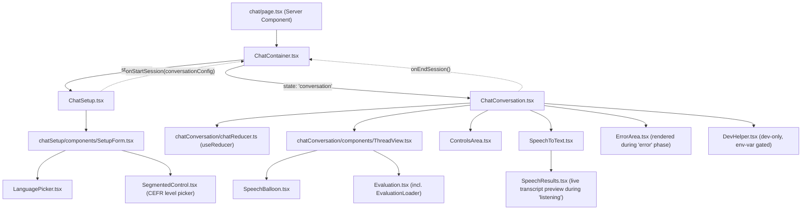
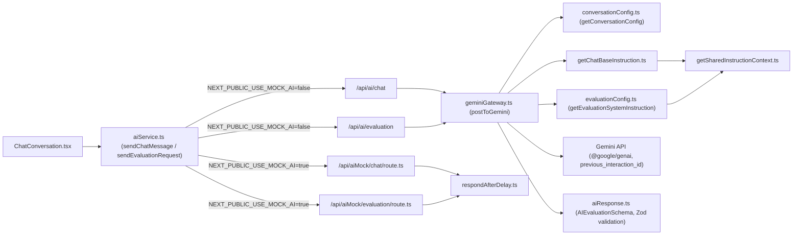

# Architecture reference

Dev reference only (not a case-study artifact). Two diagrams: component ownership/render tree, and
the route/API boundary. Keep this file updated alongside decisions.md when structure changes —
Mermaid renders natively on GitHub and in VS Code (with the Mermaid extension), no build step
needed.

**Confidence note:** file _locations_ below are verified against the real tree (2026-08-18); render
relationships (which component renders which) are confirmed by project owner as of this update.

---

## Component tree

Shared components (`src/components/`) used across both branches — not tied to chat specifically:
`Button`, `Loader`, `Feedback`, `Icon`, `PageHeading`, `Logo`, `Header`.

---

## Route / API boundary

Notes:

- Both real routes share `geminiGateway.ts`'s call logic; chat and evaluation each build their own
  system instruction, both funneling shared persona context through
  `getSharedInstructionContext.ts` (dedup landed 2026-08-18).
- Mock routes are structurally parallel to real ones (same `AIChatResult` contract) so
  `aiService.ts` doesn't need to know which is active beyond the env flag.
- `AIEvaluationSchema.safeParse` runs client-side (confirmed), not inside the route — the route
  returns raw JSON, validation happens before it reaches `chatReducer.ts`.
